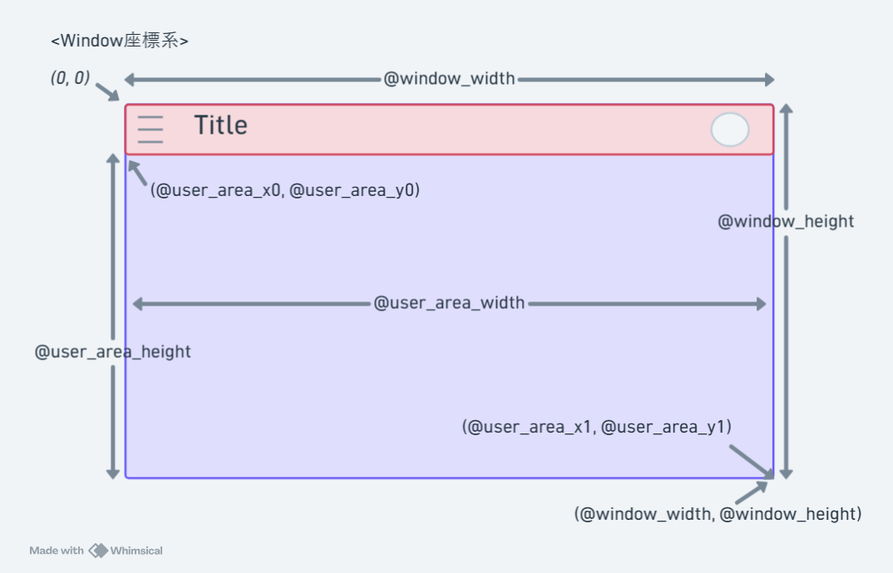
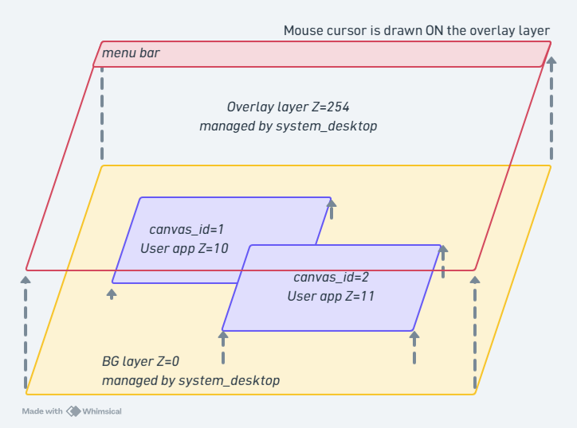
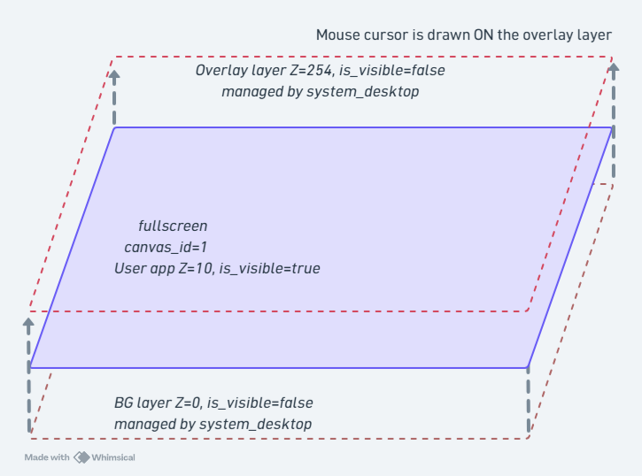

# FmrbGfx

`FmrbGfx` is the class that provides drawing APIs. In apps that inherit from `FmrbApp`, it is accessible as `@gfx`.

!!! warning "Nothing appears until `present` is called"
    All drawing commands are accumulated in a buffer. They reach the graphics side and appear on screen when `@gfx.present` is called.

## Coordinate System

The origin (0, 0) is at the top-left of the window, with X increasing to the right and Y increasing downward. You cannot draw outside the window.

Each window has its own coordinate system. See the image below for reference.




## Color

Uses RGB332 (8-bit, R:3 G:3 B:2). Specified as an integer from `0x00` to `0xFF`.

For some colors, constants like `FmrbGfx::WHITE` are also provided. A helper method `FmrbGfx.rgb_to_332(r, g, b)` is available to convert from 24-bit values.

You can also check colors on sites like [this one](https://roger-random.github.io/RGB332_color_wheel_three.js/).

A feature for using a single designated color as a transparent color is also available.

### Drawing Layer Overview

Drawing layers in normal mode



Drawing layers in fullscreen mode



### Color Constants

| Constant | Value |
|---|---|
| `FmrbGfx::BLACK` | `0x00` |
| `FmrbGfx::WHITE` | `0xFF` |
| `FmrbGfx::RED` | `0xE0` |
| `FmrbGfx::GREEN` | `0x1C` |
| `FmrbGfx::BLUE` | `0x03` |
| `FmrbGfx::YELLOW` | `0xFC` |
| `FmrbGfx::CYAN` | `0x1F` |
| `FmrbGfx::MAGENTA` | `0xE3` |
| `FmrbGfx::GRAY` | `0x6D` |

### Color Conversion

```ruby
FmrbGfx.rgb_to_332(255, 128, 0)  # -> 0xF0 etc.
FmrbGfx.hsv_to_rgb(120, 255, 255) # -> [r, g, b] (each 0..255)
```

## Control Methods

| Method | Purpose |
|---|---|
| `clear(color)` | Clear the entire screen |
| `present` | Apply accumulated drawing commands to the screen |

## Basic Shapes

All take a `color` (RGB332) as the last argument.

| Method | Signature |
|---|---|
| `set_pixel` | `set_pixel(x, y, color)` |
| `draw_line` | `draw_line(x1, y1, x2, y2, color)` |
| `draw_rect` | `draw_rect(x, y, w, h, color)` (outline only) |
| `fill_rect` | `fill_rect(x, y, w, h, color)` (filled) |
| `blend_rect` | `blend_rect(x, y, w, h, color, mode:)` (`mode: 0`=ADD, `1`=XOR) |
| `draw_circle` | `draw_circle(x, y, r, color)` |
| `fill_circle` | `fill_circle(x, y, r, color)` |
| `draw_ellipse` | `draw_ellipse(x, y, rx, ry, color)` |
| `fill_ellipse` | `fill_ellipse(x, y, rx, ry, color)` |
| `draw_round_rect` | `draw_round_rect(x, y, w, h, radius, color)` |
| `fill_round_rect` | `fill_round_rect(x, y, w, h, radius, color)` |
| `draw_triangle` | `draw_triangle(x0, y0, x1, y1, x2, y2, color)` |
| `fill_triangle` | `fill_triangle(x0, y0, x1, y1, x2, y2, color)` |
| `draw_arc` | `draw_arc(x, y, r0, r1, angle0, angle1, color)` |
| `fill_arc` | `fill_arc(x, y, r0, r1, angle0, angle1, color)` |

Angles for `draw_arc` / `fill_arc` are integers in degrees. `r0` is the inner radius, `r1` is the outer radius.

## Text Drawing

```ruby
@gfx.set_text_size(2)             # 1 to 4
@gfx.draw_text(10, 20, "Hello",
               FmrbGfx::BLACK)    # No bg -> transparent
@gfx.draw_text(10, 40, "Hi",
               FmrbGfx::WHITE,
               FmrbGfx::BLUE)     # With bg -> opaque
```

| Method | Purpose |
|---|---|
| `set_text_size(size)` | Text size. `1` to `4` |
| `draw_text(x, y, text, color [, bg_color], mixed: false)` | Draw text. `mixed: true` enables ASCII/Japanese hybrid rendering |
| `set_font(family, size = nil)` | Switch font (see below) |
| `current_font` / `current_text_size` | Current font / size (read-only) |

## Japanese Text and Font Switching

By switching to a Japanese font with `set_font(family, size)`, you can draw UTF-8 strings directly.

```ruby
# Default ASCII font (Font0, 6x8)
@gfx.set_font(:default)
@gfx.draw_text(10, 20, "Hello", FmrbGfx::BLACK)

# Japanese 8px (misaki_8, small size matching the system UI)
@gfx.set_font(:ja, 8)
@gfx.draw_text(10, 40, "こんにちは", FmrbGfx::BLACK)

# Japanese 12px (efontJA_12, larger and more readable)
@gfx.set_font(:ja, 12)
@gfx.draw_text(10, 60, "ファミリーmruby", FmrbGfx::BLACK)
```

### Supported Fonts

| `family` | `size` | Description |
|---|---|---|
| `:default` | (not specifiable) | Font0 6x8 ASCII. Default at startup |
| `:ja` | `8` | misaki_8 8x8, same size as system UI |
| `:ja` | `12` | efontJA_12 12x12, more readable |

### Hybrid Drawing (`mixed: true`)

Strings containing mixed ASCII and Japanese characters can be drawn in a single `draw_text` call. ASCII portions are rendered with Font0 (6x8) and UTF-8 multibyte portions with misaki_8 (8x8).

```ruby
@gfx.draw_text(10, 20, "puts 'こんにちは'",
               FmrbGfx::BLACK, mixed: true)
```

Convenient for code examples and bilingual UI strings.

!!! tip "`draw_window_frame` saves and restores the font"
    `FmrbApp#draw_window_frame` always draws the title bar with the default 6x8 font and then restores the font setting from before the call. There is no need to call `set_font` again each frame in your app.

!!! note "JA font loading cost"
    The first call to `set_font(:ja, ...)` takes several tens of milliseconds as the graphics side prepares the font data. Ideally, call it once in `on_create`.

### Example (Japanese)

```ruby
class HelloJaApp < FmrbApp
  def on_create
    clear_user_area(FmrbGfx::WHITE)
    @gfx.set_font(:ja, 12)
    @gfx.draw_text(@user_area_x0 + 8, @user_area_y0 + 8,
                   "こんにちは、Family mruby!", FmrbGfx::BLACK)
    draw_window_frame
    @gfx.present
  end
end

HelloJaApp.new.start
```

A sample that switches between modes (default / 8px / 12px / Mixed / Hybrid / Scaled) is available in `/app/demo/ja_text.app.rb`.

## Image API

```ruby
# File transfer (PC -> flash)
@gfx.transfer_file("local.bmp", "/img.bmp")

# Load and draw an image
img = @gfx.create_image_from_file("/img.bmp")
@gfx.draw_image(img[:id], 10, 20)               # Original size
@gfx.draw_image(img[:id], 10, 20, scale_x: 2.0,
                scale_y: 2.0)                   # 2x scale
@gfx.delete_image(img[:id])
```

| Method | Return Value / Purpose |
|---|---|
| `transfer_file(src, dst)` | `true` on success, raises exception on failure |
| `file_status(path)` | `{exists:, size:}` |
| `create_image_from_file(path)` | `{id:, width:, height:}` or `nil` |
| `draw_image(id, x, y, scale_x: 1.0, scale_y: 1.0)` | Draw an image |
| `draw_tile(image_id, src_x, src_y, w, h, dst_x:, dst_y:)` | Copy a sub-region of an image to `(dst_x, dst_y)`. For tile map use |
| `delete_image(id)` | Release the image |

!!! note "Supported image formats"
    `create_image_from_file` supports RGB332 BMP. See [Image & Icon Files](../file_formats/image_formats.md) for format details.

### When to Use `draw_tile`

You can directly stamp part of a SpriteImage onto the canvas without creating a `SpriteInstance`. This is suitable for BG rendering where you tile 16x16 cells from a tile sheet image one by one. The transparent color of a SpriteImage created with `use_transparent: true` is respected, enabling layered map drawing.

```ruby
sheet = SpriteImage.new(@gfx, width: 64, height: 32,
                          transparent_color: 0, use_transparent: true)
sheet.load_bmp("/usr/share/sprites/tilesheet.bmp")
# Draw 16x16 from tilesheet at (0, 0) to canvas at (32, 16)
@gfx.draw_tile(sheet.id, 0, 0, 16, 16, dst_x: 32, dst_y: 16)
```

For a higher-level wrapper, see [TileMap](tilemap.md).

## Composite Region Specification (`set_composite_regions`)

```ruby
@gfx.set_composite_regions([
  {dst_x: 0,   dst_y: 0,   w: 4, h: 4, transparent: true},   # Top-left rounded corner
  {dst_x: w-4, dst_y: 0,   w: 4, h: 4, transparent: true},   # Top-right
  {dst_x: 0,   dst_y: 4,   w: w, h: h - 8, transparent: false},  # Center is opaque
  # ...
])
```

A performance API that specifies which rectangles of the canvas are composited and how (transparent mode / opaque mode). Useful for rounded-corner windows where only the corners use transparency while the center uses a fast memcpy path. Maximum 8 regions. Passing `nil` or `[]` clears the setting.

Normally, the system configures this via the `rounded_corners` flag in `.toml` ([App Configuration > rounded_corners](../file_formats/app_toml.md)), so user apps rarely need to use this directly.

## NTSC Output Adjustment (Retro only)

| Method | Purpose | Range |
|---|---|---|
| `set_output_level(level)` | Overall brightness | 0..255 |
| `set_chroma_level(level)` | Saturation (color burst amplitude) | 0..255 |

Used for color adjustment on CRT monitors (see [NTSC Output Test](../examples.md) sample).

## Example: Drawing Shapes

```ruby
class ShapesApp < FmrbApp
  def on_create
    clear_user_area(FmrbGfx::WHITE)
    x = @user_area_x0 + 5
    y = @user_area_y0 + 5
    @gfx.fill_rect(x, y, 30, 20, FmrbGfx::RED)
    @gfx.fill_circle(x + 60, y + 10, 10, FmrbGfx::GREEN)
    @gfx.draw_round_rect(x + 90, y, 30, 20, 4, FmrbGfx::BLUE)
    @gfx.draw_text(x, y + 30, "Shapes",
                   FmrbGfx::BLACK)
    draw_window_frame
    @gfx.present
  end

  def on_update
    500
  end
end

ShapesApp.new.start
```

## Notes

!!! warning "Batch drawing with present"
    Within `on_update`, which is called at high frequency, it is recommended to issue multiple drawing commands and then call `present` only once. Calling `present` after every individual command can saturate the UART bandwidth.

!!! warning "Do not draw outside the window frame"
    Draw within the `@user_area_x0/y0/width/height` bounds. Overwriting the title bar or borders will break the visual appearance.

## Related

- For sprites and tile maps, see [Sprite](sprite.md)
- `GfxBlock` for efficient dynamic GUI rendering is also described in [Sprite](sprite.md#gfxblock)
