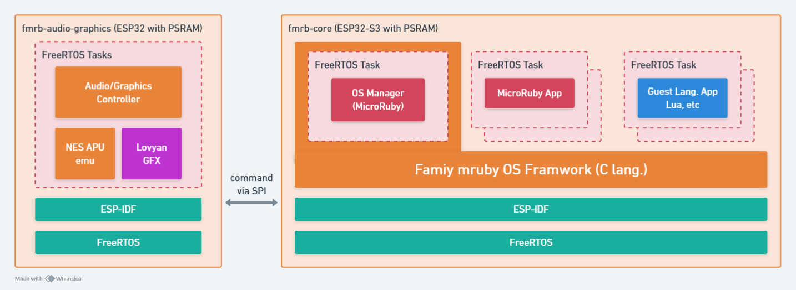

# アーキテクチャ

  

Family mruby は、FreeRTOS上に構築された「MicroRubyベースのマルチVM」を実装する個人プロジェクトです。このシステムは複数のMicroRuby仮想マシンを同時実行できます。

アーキテクチャは2つの主要コンポーネントで構成されています：

- **fmrb-core (ESP32-S3 with PSRAM)**: Family mruby OSフレームワークを実行するメイン処理ボード。複数のFreeRTOSタスクをホストし、それぞれが独立したVMを実行します：
    - OS Manager (MicroRuby): システム管理と調整
    - MicroRuby App: Rubyで書かれたユーザーアプリケーション
    - Guest Language Apps: Luaなどの他のスクリプト言語のサポート

- **fmrb-audio-graphics (ESP32 with PSRAM)**: オーディオ/グラフィックス処理を担当する専用ボード。Audio/Graphics Controller、NES APUエミュレータ、LovyanGFXライブラリを含みます。コアボードとは UART 経由で通信します。

## マルチVM

このシステムは「一つのタスク = 一つのVM」という設計思想に従い、FreeRTOSのタスク機能を活用して複数のVMを並列実行します。各VMは独自のスタックとメモリ空間を持ち、独立して動作することで隔離性と安定性を確保しています。

## 主な特徴

- **OSの基盤**: ESP-IDF上で動作するFreeRTOS
- **VM実装**: mrubyベースのMicroRuby VMを使用
- **独立したメモリプール**: 各VMは独自のメモリアロケータハンドルを持ち、システム全体のメモリ断片化を防止し、個々のVMの障害を隔離します
- **多言語サポート**: MicroRubyを主要サポート、Luaの実験的サポート、MicroPythonの統合も計画中

## ターゲットハードウェア

PSRAMを搭載したESP32デバイス（例：ESP32-S3-WROOM-1-N16R8）向けに設計されています。カスタム開発ボードも開発中です。
