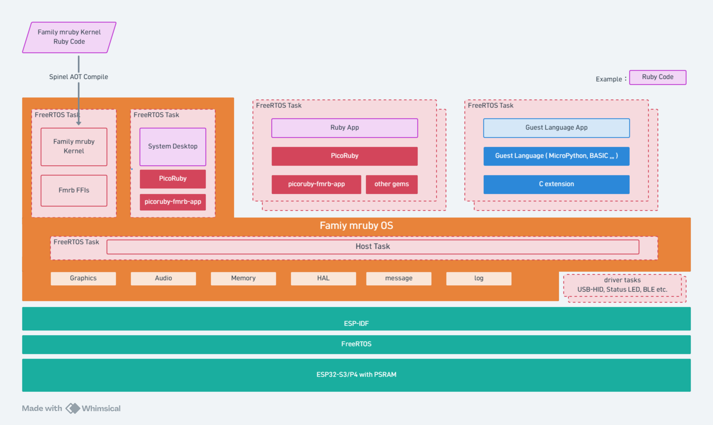

# アーキテクチャ

Family mruby は、FreeRTOS の上に載った小さな多 VM オペレーティングシステムです。複数の
スクリプト VM が並んで動き、FreeRTOS のタスク 1 つに VM 1 つ、それぞれが自分のヒープを
持ちます。だから 1 つのアプリがメモリを使い切っても、落ちても、システム全体は道連れに
なりません。



## タスク 1 つに VM 1 つ

設計の原則は 1 タスク = 1 VM です。各 VM は自分のスタック、自分のメモリ領域、自分の
確保用ハンドルを持ちます。この隔離があるから、書きかけのプログラムをデスクトップの隣で
動かしても安全です。

| | |
|---|---|
| 同時に動くユーザアプリ | 3 |
| アプリ 1 つあたりのヒープ | 512KB。`large_memory = 1` で 1MB |
| 言語 | Ruby (PicoRuby)、BASIC、MicroPython、Lua |

領域を分けているのは整理のためだけではありません。メモリの断片化は原因となったアプリの
中に留まり、アプリが終わればその領域はまるごと回収されます。

## カーネルは「コンパイルされた Ruby」

2.0 での変更点です。カーネルとデスクトップは Ruby で書かれていますが、もう解釈実行では
ありません。同じソースを別の方式で機械語に事前コンパイルしています。VM で動かしていた
ときと比べて、入力の遅れが大きく減りました。

利用者が書くアプリは、これまでどおり PicoRuby の VM で動きます。コンパイルされるのは
システム自身の Ruby だけです。

## ハードウェアの形は 2 つ

同じ OS が、まったく違う 2 つの構成で動きます。

### Modern — 1 個のチップが全部やる

```
ESP32-P4  ── OS、VM、描画、音、入力、USB ホスト
   │
   ├── MIPI-DSI 液晶 (1280x720)。426x240 のバッファを PPA で拡大
   ├── I2S コーデック、APU エミュレータ
   ├── GT911 タッチ、Tab5 Keyboard (I2C)、USB HID ホスト
   └── ESP32-C6 (SDIO) ── WiFi + BLE
```

描画も音も本体の中で完結します。P4 が自分でバッファを合成し、PPA が液晶の大きさに
拡大します。話しかける相手のチップがいないので、同じ Ruby アプリでも描画が速くなります。

### Retro — 2 個のチップで分担する

```
ESP32-S3 ── OS、VM、入力、USB ホスト、WiFi/BLE
   │
   │  UART, 921600 bps, CTS/RTS フロー制御
   ▼
ESP32-WROVER ── 描画 + 音
   ├── NTSC コンポジット出力 (LovyanGFX CVBS)
   └── ファミコン風 APU エミュレータ、I2S DAC
```

S3 が描画と音の命令をシリアルで送り、WROVER がそれをコンポジット映像と音声にします。
チップは 2 つとも書き込む必要があり、両方の版を揃える必要があります。この間のやりとりが
決められた手順だからです。

## アプリから見えるもの

上のことは何も見えません。描画も音も周辺機器も、両機種で同じ呼び方です。片方ではその
呼び出しが手元の描画部に渡り、もう片方では UART に載って送られる、という違いだけです。
画面の大きさを決め打ちせず、配線を `FmrbConst::BOARD` で分けておけば、同じアプリが
どちらでもそのまま動きます。

ハードウェアはシステム側が持ち、GPIO・I2C・RMT・ファイルは代理を通して使います。だから
複数の VM が同じバスを取り合わずに使えます。

## 開発の対象

同じソースから 3 つのビルドが出ます。

| 対象 | 内容 |
|---|---|
| `esp32` / Modern | ESP32-P4 (M5Stack Tab5) |
| `esp32` / Retro | ESP32-S3 + ESP32-WROVER (narya-board) |
| `linux` | システム全体を Linux のプロセスとして動かします。画面は SDL2。[シミュレータ](getting_started/simulator.md) を参照 |

Linux 版は模擬品ではありません。本物のカーネル、本物のデスクトップ、本物のアプリが動き、
下のドライバだけが差し替わっています。作業の大半は実機に触れる前にここで済みます。

## 関連

- [ハードウェア](hardware.md) — 基板の詳細
- [機種の選択](getting_started/choose_hardware.md)
- [制約事項](limitations.md) — どこに限界があるか
