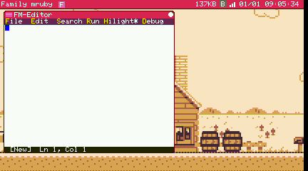

# Debugging

New in 2.0. There are two ways to stop a running app and look inside it: the debugger built
into the on-device editor, and a remote debugger your PC drives over TCP or BLE.

Both work on real hardware and in the [simulator](getting_started/simulator.md).

## On the device: the editor's debugger

The editor (`E` on the desktop) can debug an app without any PC involved.

<div align="center">
  
</div>

### Running

`F5` runs the file you are editing. No save-and-launch dance.

### Attaching

**Debug** → **Attach...** lists the running apps; pick one and the editor splits, showing a
stack pane and a variables pane below the text.

Once attached, a gutter appears down the left side of the text where breakpoints live:

| Key | Action |
|---|---|
| `F5` | Continue |
| `F6` | Pause |
| `F10` | Step over |
| `F11` | Step in |
| `Shift` + `F11` | Step out |
| `F7` / `F8` | Move up and down the call stack |
| `F4` | Switch between the stack pane and the variables pane |

The **Debug** menu carries the same commands, plus **Toggle BP** for setting a breakpoint on
the current line and **Detach** for ending the session.

A breakpoint shows as a red dot in the gutter; the line where execution is parked is
highlighted.

!!! note "One debugger at a time"
    A device holds one debug session. If the editor is attached, a remote debugger cannot
    attach as well, and vice versa. Detach before switching.

## From your PC: the remote debugger

The device runs a debug service that speaks a msgpack protocol over one of two transports:

| Transport | Where |
|---|---|
| **TCP** | The Linux simulator, and any target reachable over the network |
| **BLE** | ESP32 hardware, over a GATT service — no cable needed |

### The command-line client

`tool/debug/fmrb_dbg_client.py` in the repository is both a library and a small interactive
client:

```bash
# One-shot command
python3 tool/debug/fmrb_dbg_client.py localhost:5555 stack_trace

# Interactive session
python3 tool/debug/fmrb_dbg_client.py localhost:5555

# Over BLE, scanning for a single Family mruby device
python3 tool/debug/fmrb_dbg_client.py ble
```

The target is `host[:port]` for TCP (port 5555 by default), or `ble`, or
`ble:<name-or-address>` when more than one device is in range.

It needs the `msgpack` package; BLE additionally needs `bleak`.

### From an editor that speaks DAP

`tool/debug/fmrb_dap_adapter.py` puts a Debug Adapter Protocol front end on the same client,
so an editor that speaks DAP — VS Code, among others — can set breakpoints, step, and
inspect variables against the running device.

## The web console's debug panel

The [web console](getting_started/console.md), which talks to the device over BLE from a
browser, has a debug panel for the coarse operations: list the running apps (`ps`), kill one,
and spawn another. It is the quickest way to get an app off the device when it is
misbehaving, without reaching for a debugger session.

## Reading what the system says about itself

Not every problem needs a breakpoint. The system prints its own state periodically, and
those numbers usually locate a problem faster:

- **Log Viewer** in the system menu shows the log on the device
- The periodic dump reports each task's remaining stack, the VM pools' occupancy, and
  graphics timings
- `Monitor` in the system menu shows running tasks and memory at a glance

For an app that is running out of memory, that dump tells you which pool and how close it
is, which a debugger will not.

## Related

- [Console](getting_started/console.md) — moving files and running commands over BLE
- [Remote Desktop](remote_desktop.md) — driving the device's UI from a browser
- [Simulator](getting_started/simulator.md) — debug the whole system on Linux first
