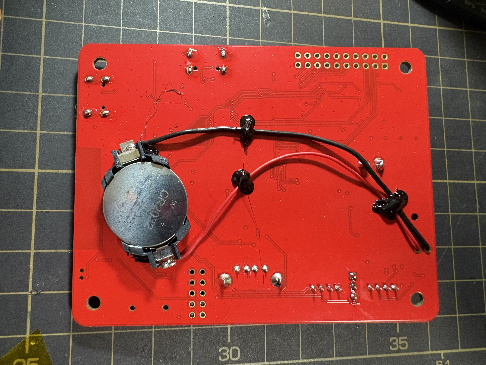

# BOOTHで購入した方へ

[こちら](https://booth.pm/ja/items/8128031)の販売ページで基板を購入された方へ。

同梱物を確認して、もし不足があれば、BOOTHのメッセージから連絡お願いいたします。

問題なければ、[起動まで](../setup) に進んでください。

## 同梱物の確認

| 項目 | 個数 | 備考 |
|---|---|---|
| Narya 基板 | 1 | Family mruby用基板 |
| 台座板 | 1 | 基板の台座につかえる板 |
| スペーサ | 4 | 基板の台座用のスペーサ |
| M3ネジ | 8 | スペーサと基板、台座板を止めるネジ |
| ピンヘッダ(3P) | 1 | GROVE2の電源選択用 |

USB ケーブル・映像ケーブル・音声ケーブルなどは含まれません（次節を参照）。

## 組み立て

写真のように基板の四隅の穴にスペーサをネジで固定します。

天板は付属してませんが、スペーサを付け足すことで、天板をつけることも可能です。

## 天板を作りたい方へ

以下の寸法で板を作ると基板と同じサイズになるので、M3スペーサとネジで止めることができます。

- 寸法：700mm x 900mm
- 穴の位置：各四隅から5.5mm

## RTC電源の取り付け

RTCに電源を供給したい場合は、RTC電源の＋－の部分にCR2032コイン電池ケースをはんだ付けで接続します。

- ケースおよび電池は付属していないので、必要な方は準備お願いします。
- 電源の正負の向きを間違えるとRTCが故障する可能性あるのでご注意ください。
- 裏面に配線するときれいですが、電池ケースの電極が背面のはんだ面などに接触してショートしないように絶縁にご注意ください。

基板裏に電池ケースを取付けた例（注意：試作品のため基板の色が赤いです）

## ピンヘッダのはんだ付け（必要な場合）

GROVE2の電源のラインは初期状態では何も接続されてません。

もし電源を出力したい場合、下図のGROVE2電源選択の箇所にピンヘッダをはんだ付けした上で、ジャンパーピン（付属してません）を取り付けることで、5Vか、3.3Vの電源出力を選択できます。

