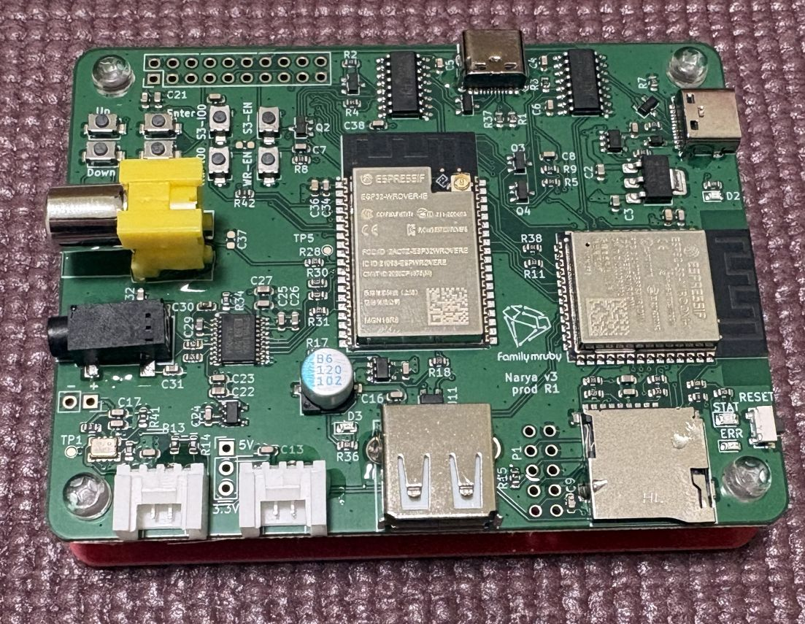
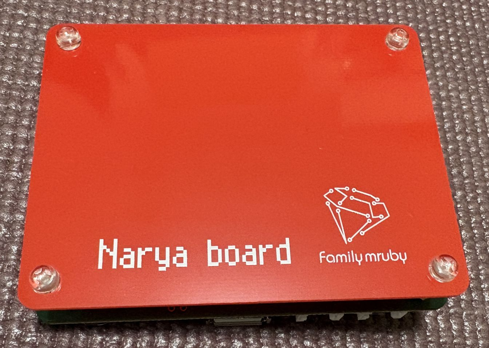

# For BOOTH Buyers

For those who purchased a board from [this sales page](https://booth.pm/ja/items/8128031).

Please check the included items, and if anything is missing, contact us via BOOTH messaging.

If everything is in order, proceed to [Setup](../setup).

## Included Items

| Item | Quantity | Notes |
|---|---|---|
| Narya board | 1 | Board for Family mruby |
| Base plate | 1 | Plate used as a base for the board |
| Spacers | 4 | Spacers for the board base |
| M3 screws | 8 | Screws to fasten the spacers, board, and base plate |
| Pin header (3P) | 1 | For selecting the power source of GROVE2 |

USB cables, video cables, audio cables, etc. are not included (see the next section).

## Assembly

As shown in the photo, attach the spacers to the four corner holes of the board using screws.

A top plate is not included, but you can add one by using additional spacers.

## For Those Who Want to Make a Top Plate

A plate made with the following dimensions will match the board size and can be fastened with M3 spacers and screws.

- Dimensions: 700mm x 900mm
- Hole positions: 5.5mm from each corner

## Installing the RTC Power Source

If you want to supply power to the RTC, solder a CR2032 coin cell battery holder to the + and - terminals of the RTC power section.

- The holder and battery are not included, so please prepare them yourself if needed.
- Be careful not to reverse the polarity, as it may damage the RTC.
- Wiring on the back side looks clean, but be sure to insulate the battery holder's electrodes so they don't contact the solder pads on the back and cause a short circuit.

