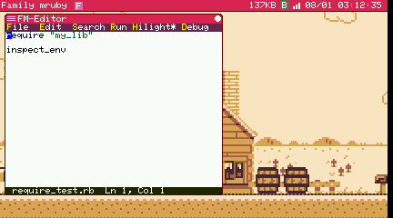
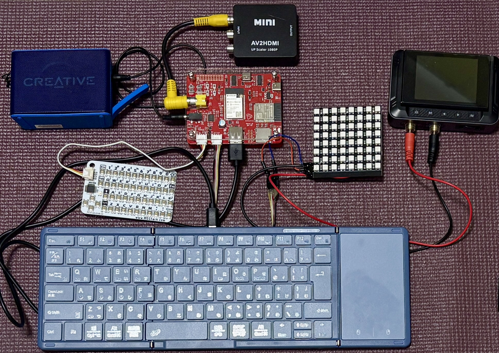

# 機種の選択

Family mruby は 2 種類の機械で動きます。OS も API もアプリも同じで、違うのは映像の出し方、
持ち方、そして何のための機械かというところです。

## Modern — M5Stack Tab5

<div align="center">
  
</div>

市販の [M5Stack Tab5](https://docs.m5stack.com/ja/core/Tab5) をそのまま使います。改造も
はんだ付けも不要で、ブラウザから書き込めばデスクトップが立ち上がります。

ESP32-P4 が 1 個で OS・描画・音・入力の全部を動かし、その横で ESP32-C6 が WiFi と BLE を
受け持ちます。画面が本体についているので、これ一台で計算機として完結します。

**Modern が向いているのは**、コードを書きたい、持ち歩きたい、タッチで操作したい、
ネットワークにつなぎたい、パソコンのブラウザから WiFi 越しに操作したい場合です。

→ [Modern (M5Stack Tab5): 箱から出してデスクトップが出るまで](modern.md)

## Retro — narya-board

<div align="center">
  
</div>

専用基板です。[BOOTH](https://booth.pm/ja/items/8128031) で販売していて、設計データも公開
しているので自作もできます。ESP32-S3 が OS を動かし、映像と音をもう 1 個の ESP32 に渡して、
**本物の NTSC コンポジット映像** — ブラウン管テレビがそのまま受け取れる信号 — と
ファミコン風の APU 音声を作ります。

**Retro が向いているのは**、ブラウン管に映したい、320x240・256 色というあの音源に合った
世界で作りたい、GROVE 端子や電池で動く時計に何かをつなぎたい場合です。

→ [起動まで (Retro)](setup.md)

## 並べて比べる

| | **Modern** | **Retro** |
|---|---|---|
| ハードウェア | M5Stack Tab5 (市販品) | narya-board (BOOTH、または自作) |
| チップ | ESP32-P4 + ESP32-C6 | ESP32-S3 + ESP32-WROVER |
| 表示 | 本体内蔵 1280x720 IPS 液晶 (MIPI-DSI) | NTSC コンポジット、RCA 端子 |
| 表示バッファ | 426 x 240 (画面上では 3 倍) | 320 x 240 |
| 色数 | 256 色 (RGB332) | 256 色 (RGB332) |
| 音 | 内蔵スピーカー + ヘッドホン端子 | 3.5mm ライン出力 |
| 音源 | ファミコン風 APU (4 音) | ファミコン風 APU (4 音) |
| ポインタ | タッチ画面、または USB マウス | USB マウス |
| キーボード | Tab5 Keyboard、または USB キーボード | USB キーボード |
| USB ホスト | USB-A 端子 | USB-A 端子 |
| WiFi / BLE | 両方同時に使える (ESP32-C6) | どちらか一方のみ (無線が 1 系統) |
| 遠隔画面 | あり (WiFi 越しにブラウザから) | なし |
| 拡張 | GROVE x1 | GROVE x2、電池で動く時計 |
| ストレージ | 内蔵フラッシュ 16MB。microSD はまだ未対応 | 内蔵フラッシュ 16MB + microSD |
| 書き込むファームウェア | 1 つ (`fmruby-core-tab5`) | 2 つ (`fmruby-core` + `fmruby-graphics-audio`) |
| 電源 | USB-C、内蔵電池 | USB-C |

## 両方で同じもの

- Ruby の API。片方で書いたアプリはもう片方でも動きます
- デスクトップ、ランチャー、エディタ、シェル、ファイル管理
- 同梱アプリ一式 (ゲームやデモも含む)
- BASIC (`.bas`)、MicroPython (`.py`)、Lua のアプリ
- Ruby のネットワーク API、MIDI 出力
- [シミュレータ](simulator.md)。実機が無くても Linux 上で全部動きます

## コードで気をつける違い

ほとんどありませんが、2 つだけ知っておくとよいことがあります。

**画面の大きさ**。Modern は 426 x 240、Retro は 320 x 240 です。決め打ちの数値ではなく、
アプリに与えられた描画領域から組み立てると、同じコードが両方の画面を埋めます。

```ruby
cx = @user_area_x0 + @user_area_width  / 2
cy = @user_area_y0 + @user_area_height / 2
```

一覧は [FmrbApp > ウィンドウの座標](../api/fmrb_app.md) を参照してください。

**配線**。GROVE のピン番号は基板ごとに違います。ハードウェアを触るアプリでは基板で分岐します。

```ruby
pin = case FmrbConst::BOARD
      when "tab5", "naryav4" then 54   # Tab5 の GROVE、SCL 側
      else                        48   # narya-board の GROVE 2
      end
```

`FmrbConst::BOARD` は `"tab5"` / `"naryav4"` / `"atom_display"` / `"narya_v3"` / `"linux"`
のいずれかです。

両機種のピン配置は [ハードウェア](../hardware.md) にあります。
