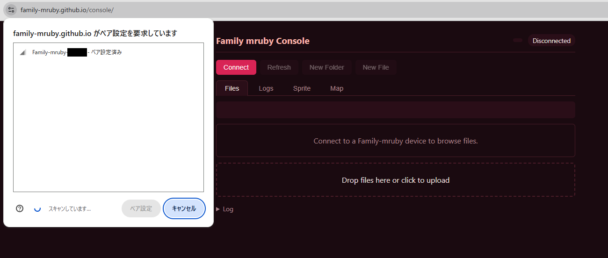
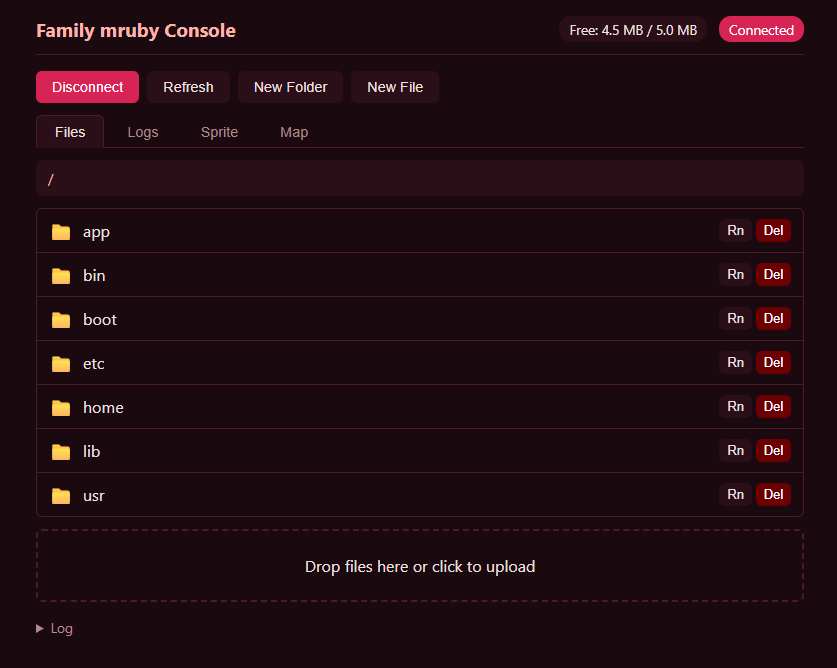
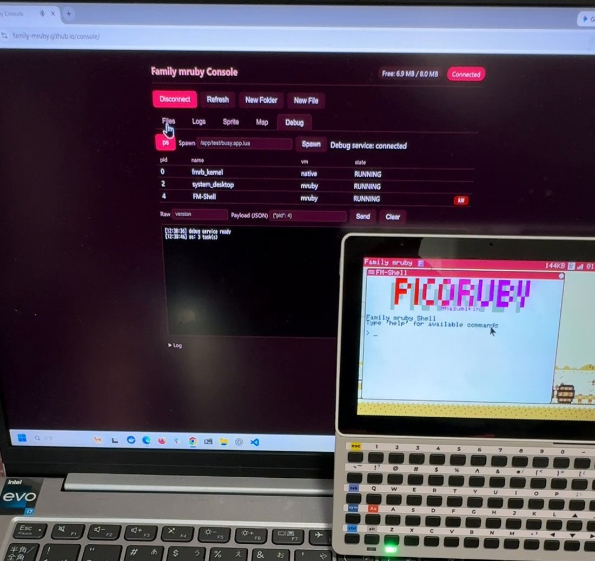

# Family mruby コンソール

BLE で実機につながるブラウザのクライアントです。ファイル、ログの実時間表示、スプライトと
地図の編集、デバッグ用の操作ができます。入れるものはありません。

## 必要なもの

- BLE通信できるPC
- Web Bluetooth 対応ブラウザ ( Chrome / Edge )（Firefox / Safari は不可）

## クライアントの起動

ブラウザで以下を開きます。

[https://family-mruby.github.io/console/](/console/)

## 接続手順

1. 基板の電源を入れて起動完了を待つ（数秒）
2. ブラウザでクライアントを開く
3. 画面の 「Connect」ボタン をクリック
4. ブラウザの BLE デバイス選択ダイアログから 「Family-mruby-XXXXXX」 を選択
5. 「ペア設定」ボタンを押す（OS によっては「接続」と表示）

!!! danger "BLE は電波の届く範囲の誰にでも開いています"
    この機械はペアリングも暗号化も行いません。そのおかげで Windows の Web Bluetooth が
    素直に繋がるのですが、同時に、繋いでくる相手に何も求めないということでもあります。
    電波の届く範囲でブラウザを開いた人は誰でも、ボード上のファイルを読み書きし、ログを
    読み、アプリを起動したり止めたりできます。届かないようにしたいときは、Config の
    `ble_auto_start` かシステムメニューから BLE を止めてください。
    [セキュリティ](../limitations.md#セキュリティ) も参照してください。

!!! warning "Windows でうまく繋がらない場合"
    Windows の Bluetooth スタックは古いペアリング情報を保持して接続を妨げる場合があります。OS の Bluetooth 設定で 既存の `Family-mruby-*` を削除 してから再接続を試してください（本機はペアリングを保持しないため）。

## ファイルのアップロード（PC → 基板）

1. クライアントで配置先ディレクトリへ移動
2. PC のエクスプローラからファイルをブラウザにドラッグ&ドロップ
3. 完了を待つ

## ファイルのダウンロード（基板 → PC）

1. クライアントでファイルを表示
2. ダウンロードアイコンをクリック
3. PC の標準のファイル保存ダイアログで保存先を指定

## アップロード後の反映

アプリファイル (`.app.rb` / `.app.toml`) を `/app/<dir>/` にアップロードしただけでは、ランチャーには即座には現れません。次のいずれかで反映できます:

- ランチャーを開いて右クリック — タイトルバーが「Rescanning...」になり、1〜2 秒で新アプリが表示される
- 本体を再起動 — 起動時のスキャンで自動的に乗る

詳細は [Hello World ▸ ランチャーで反映する](hello_world.md#ランチャーに反映する) を参照。

## クライアントでできること

上部に 5 つのタブがあります。

| タブ | 用途 |
|---|---|
| Files | フラッシュの中を見る。ドラッグして送る、取り出す、名前を変える、ファイルやフォルダを作る・消す |
| Logs | 実機のログを流しながら表示。部分一致で絞り込めます |
| Sprite | RGB332 のスプライト表をブラウザで編集して書き戻す |
| Map | タイル地図を編集する |
| Debug | 動いているアプリの一覧 (`ps`)、終了、場所を指定しての起動、生のデバッグコマンド送信 |

Debug タブは [遠隔デバッガ](../debugging.md) と同じデバッグ用サービスにつながっています。
反応しなくなったアプリを落とすだけなら、停止点も接続も要らないこちらが一番速いです。

## 両機種で使えます

Retro だけでなく Modern でも動きます。Modern では BLE を ESP32-C6 が担当します。

違うのは、同時に何が動かせるかです。Modern の C6 は BLE と WiFi を一緒に受け持つので、
コンソールと [遠隔画面](../remote_desktop.md) を同時に使えます。Retro の ESP32-S3 は
無線が 1 系統なので、BLE と WiFi はどちらか一方です。[WiFi につなぐ](wifi.md) を参照して
ください。

そもそもブラウザの一覧に出てこない場合は、BLE が動いていない可能性があります。Config の
`ble_auto_start` を確認するか、システムメニューから手で起動してください。

## 注意事項

### 大きいファイル

通信速度はあまり早くないため、大きなファイルは転送に時間がかかります。

### 同時接続

同時に接続できるクライアントは 1 台です。別のブラウザで接続する場合は先に切断してください。

## トラブル

### デバイスが見つからない

- 基板の電源が入っているか
- 基板を再起動して数秒待つ
- OS 側で別のブラウザ・タブが繋がっていないか

### Connect が動かない

- Chrome / Edge を使っているか（Firefox / Safari は未対応）
- HTTPS または `localhost` でクライアントを開いているか

## 関連

- 自作アプリの転送先: [Hello World](hello_world.md)
- ファイルシステム構造: [ファイル・I/O](../api/filesystem.md)
- 反応しないアプリを止める: [デバッグ](../debugging.md)
