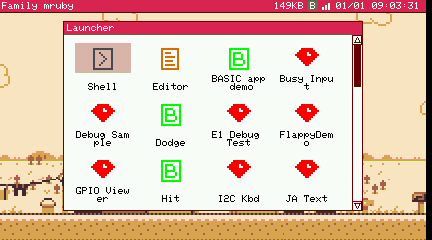
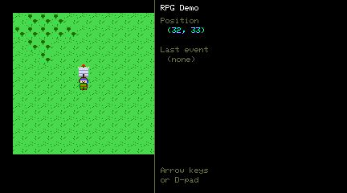

# 標準アプリ

以下はすべて実機に入っています。システムメニューから **Launcher** を開き (デスクトップで
`L` を押しても同じ)、アイコンをダブルクリックしてください。

  

!!! tip "一覧は起動時に作られます"
    ランチャーがアプリを探すのは、デスクトップの起動時の 1 回だけです。ファイルを
    足した後は、**ランチャーの窓の中で右クリック**して読み直させてください。

アプリは `/app` の下にあり、用途ごとに分かれています。以下も同じ分け方です。

## 常にあるもの

これらはランチャーの一覧には出ません。システムの側のアプリで、システムメニューか、
デスクトップで 1 文字打つと起動します。

| アプリ | キー | 内容 |
|---|---|---|
| Launcher | `L` | アプリの一覧 |
| Shell | `S` | コマンド行 |
| Editor | `E` | 書いて、実行して (`F5`)、デバッグする |
| File Manager | | フラッシュの中を見る |
| Log Viewer | | システムログ |
| Monitor | | 動いているタスクとメモリ |

## デモ — `/app/demo`

| アプリ | 内容 |
|---|---|
| **Ruby app demo** | Ruby のアプリの枠組み。写して始めるのに向いています |
| **Python** | 同じものを MicroPython で書いたもの |
| **Lua app demo** | 同じものを Lua で |
| **BASIC app demo** | BASIC のプログラムを普通のアプリとして起動したもの |
| **Shapes** | 図形の描画 |
| **Bounce** | スプライトの移動 |
| **P5 Test** | [P5](../api/p5.md) の描画 API |
| **JA Text** | 同梱フォントによる日本語表示 |
| **Kamon** | 5 種類の意匠から家紋を生成します (回転対称) |
| **Weather** | HTTPS で天気を取得して描画します。[ネットワーク API](../api/network.md) の一通り |
| **MIDI APU** | 内蔵音源を [MIDI](../api/midi.md) 層から鳴らします。外部音源にも切り替えられます |
| **MML** | 同じ曲を内蔵音源でも外部音源でも。曲は MML の文字列 |
| **StackChan** | 表情と仕草を持つ顔 |
| **StackChan Remote** | 同じ顔を [pub/sub](../api/pubsub.md) 経由で動かします |
| **PubDemo** / **SubDemo** | 送る側と受ける側。2 つ一緒に動かします |
| **LED Matrix** | GROVE から WS2812B のマトリクスを光らせます |
| **I2C Kbd** | I2C キーボードを読みます |

## ゲーム — `/app/game`

| アプリ | |
|---|---|
| **RPG Demo** | 滑らかにスクロールするタイルの世界。当たり判定、BGM、効果音つき |
| **Raycaster** | Wolfenstein 風の一人称のデモ。キーボードでもゲームパッドでも |
| **Tetris** | |
| **Shooter** | |
| **Piano** | キーボードから音源を鳴らします |

  

## 道具 — `/app/tool`

| アプリ | 内容 |
|---|---|
| **SMF Player** | 標準 MIDI ファイルを一覧から選んで演奏します。曲は `/usr/share/sounds/midi` |
| **NSF Player** | NSF (ファミコンの音楽) を再生します。曲は `/usr/share/sounds/nsf` |
| **Sprite Editor** | 16x16 の RGB332 タイル表を編集します。BMP を読み、タイルを選び、点を打ち、書き戻します |
| **PicoRabbit** | 全画面の発表用の道具。PicoRabbit 互換の Markdown を読みます |
| **GPIO Viewer** | 全 GPIO の状態を、何に使われているかで色分けして表示します |
| **Net Test** | ネットワーク API を一つずつ試します。つながらないときの切り分けに |

## BASIC の見本 — `/app/basic`

[FMRuby BASIC](../other_languages.md) のプログラムが 6 本。動かしても読んでも使えます。

| アプリ | |
|---|---|
| **Kana** | 文字画面とかなの表示 |
| **Dodge** | よけるゲーム |
| **Shoot** | シューティング |
| **Maze** | 迷路 |
| **Music** | `PLAY` と `BEEP` |
| **Hit** | 当たり判定 |

## 試験・診断用

`/app/debug` と `/app/test` には、わざと何かを壊したり負荷をかけたりするアプリが入って
います。例外を出すもの、コンパイルに失敗するもの、入力を詰まらせるもの、MIDI の時間の
計測、NTSC の色見本、SD カードやタイル地図の確認などです。日常的に使うものではなく、
実機の様子がおかしいときのために入れてあります。

## 機種によるもの

ほとんどのアプリは両機種で動きますが、片方にしかない機能に依存するものがあります。

| アプリ | 備考 |
|---|---|
| **NTSC Test** | Retro 専用。コンポジット出力を調整するもの |
| **SD Test** | Retro 専用。Modern の microSD はまだファームウェアから使えません |
| **Weather**、**Net Test** | WiFi の設定が要ります。[ネットワーク](../api/network.md) を参照 |
| **LED Matrix**、**I2C Kbd** | GROVE に何かをつなぐ必要があります |

## 関連

- [Hello World](hello_world.md) — 自分で書く
- [アプリ設定ファイル (.toml)](../file_formats/app_toml.md) — ランチャーに出す方法
- [サンプル集](../examples.md) — 説明つきのコード
