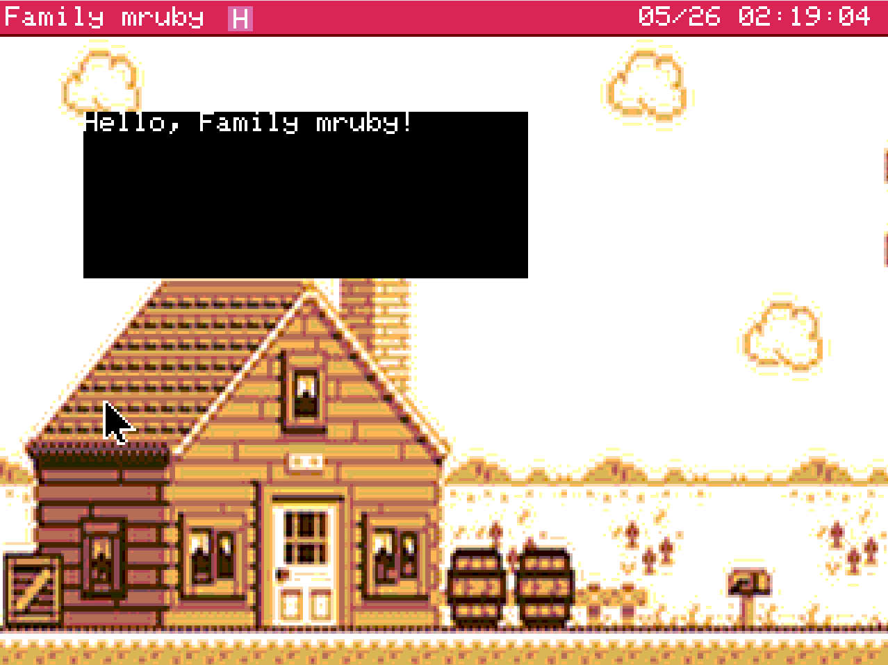
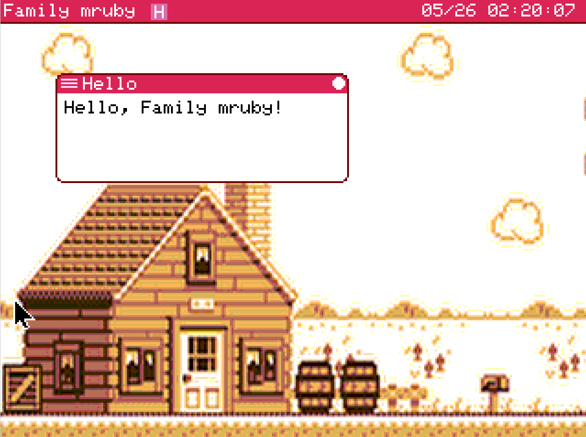

# Hello World

Run a minimal GUI app that displays "Hello, mruby!" on screen, and learn the workflow for writing your own apps.

!!! note "This page covers a GUI app example"
    Family mruby apps fall into two main categories: GUI apps that draw to the screen, and headless apps that run in the background without a display. This page walks through a minimal GUI app.
    Headless apps are not yet supported, but you can run scripts from the Shell app.

## Minimal app structure

A Family mruby app consists of a pair of 2 files.

```
hello.app.rb       # App body (Ruby)
hello.app.toml     # Configuration file
```

Place both files under `/app/<directory-of-your-choice>/`, then rescan from the launcher ([described below](#reflecting-changes-in-the-launcher)) or restart the board, and the app icon will appear.

## Step 1: A minimal app that just displays text

Let's write an app that simply draws "Hello, Family mruby!" on the screen.

!!! warning "This sample does not allow closing the window"
    `@gfx.clear` fills the entire canvas including the title bar. The title bar and close button drawn by the `FmrbApp` base class at startup are overwritten and disappear, so the close button is no longer visible on screen. To exit, reset the board once.
    The next sample adds window frame drawing.

Create `/app/usr/hello.app.rb` and implement the code below.

You can write the code in the default app editor or via the web console. See [Console](console.md) for details on the console.

### `/app/usr/hello.app.rb` file

```ruby
class HelloApp < FmrbApp
  def on_create
    @gfx.clear(FmrbGfx::BLACK)
    @gfx.draw_text(0, 0, "Hello, Family mruby!", FmrbGfx::WHITE)
    @gfx.present
  end
end

HelloApp.new.start
```

Code explanation

| Code | Role |
|---|---|
| `class HelloApp < FmrbApp` | App class that inherits from `FmrbApp` |
| `on_create` | Initialization called once at startup |
| `@gfx.clear(...)` | Fills the entire canvas with black |
| `@gfx.draw_text(0, 0, ...)` | Draws text at the top-left corner (0, 0) of the window |
| `@gfx.present` | Flushes the buffer to the screen (required) |
| `HelloApp.new.start` | Runs the app |

### `hello.app.toml` file

Create `hello.app.toml` in the same directory:

```toml
app_handle_name = "hello"
app_screen_name = "Hello"
default_window_mode = "window"
default_window_width = 160
default_window_height = 60
default_window_pos_x = 30
default_window_pos_y = 40
```

| Key | Purpose |
|---|---|
| `app_handle_name` | Internal handle name (should match the base name of the `.rb` file) |
| `app_screen_name` | Display name shown in the launcher and title bar |
| `default_window_mode` | `"window"` / `"fullwindow"` / `"fullscreen"` |
| `default_window_width/height` | Window size (px) |
| `default_window_pos_x/y` | Top-left coordinates of the window |

See [App configuration file (.toml)](../file_formats/app_toml.md) for a full list of keys.

### Launching and displaying on screen

1. Once the implementation is done, open the launcher and right-click to rescan (or restart the board)
2. The title bar shows "Rescanning..." — wait 1-2 seconds and the new "Hello" app icon will appear
3. Double-click the icon (or click with the mouse then press Enter)
4. "Hello, Family mruby!" is displayed on screen



## Step 2: Displaying the window frame

In Step 1 we only drew text. To make a practical GUI app, you need to draw the title bar and close button by paying attention to the following:

1. Fill only the app's drawable area (user area) instead of the entire window (so the title bar and border are not erased)
2. Call `draw_window_frame` after drawing (to re-render the title bar provided by the base class)

Update the code as follows.

```ruby
class HelloApp < FmrbApp
  def on_create
    redraw
  end

  def redraw
    clear_user_area(FmrbGfx::WHITE)   # Fill user area with white
    @gfx.draw_text(@user_area_x0 + 4, @user_area_y0 + 4, "Hello, Family mruby!", FmrbGfx::BLACK)
    draw_window_frame                  # Redraw title bar and border
    @gfx.present # Flush to screen
  end
end

HelloApp.new.start
```

| Point | Description |
|---|---|
| `@gfx.clear(FmrbGfx::BLACK)` to `clear_user_area(FmrbGfx::WHITE)` | Clears the area outside the title bar with the specified color |
| Added `draw_window_frame` | Redraws the frame provided by the base class. The title bar and close button are drawn |
| Drawing logic extracted into `redraw` | Organized for easier redraws later |

!!! tip "What are @user_area_* variables?"
    Coordinates of the area where the app is free to draw, excluding the title bar and borders. See [FmrbApp > Key instance variables](../api/fmrb_app.md#主要インスタンス変数) for details.

Restart and run the app — the title bar and window frame will be drawn, and you should be able to close the app by clicking the button at the top right.



## Reloading a running app after edits

After editing the code, right-click the title bar of the running app and a reload button will appear.
Running reload saves you the trouble of closing and reopening the app.

## Shortcut: Generate a template with `create_app`

Writing `.rb` and `.toml` files from scratch every time is tedious. The Family mruby shell has a `create_app` command that generates a complete set of template files based on Step 2 in one shot.

### Usage

Launch Shell from the launcher and run:

```
> create_app my_clock
Created: /app/usr/my_clock.app.rb
Created: /app/usr/my_clock.app.toml
Tip: edit it with `edit /app/usr/my_clock.app.rb`
```

This automatically creates the following files, which you can use as a template.

- `/app/usr/my_clock.app.rb` — Based on Step 2 (includes `clear_user_area` + `draw_window_frame`, with templates for all `on_*` lifecycle methods)
- `/app/usr/my_clock.app.toml` — Standard-sized window configuration

### Reflecting changes in the launcher

The launcher scans and fixes the app list at startup, so newly added files do not appear automatically. To trigger a rescan, right-click inside the launcher window. A restart also updates the list.

### App file naming conventions

The argument to the `create_app` command must contain only lowercase alphanumeric characters and underscores, starting with a letter. Examples:

| Input | Generated class name | Display name |
|---|---|---|
| `hello` | `HelloApp` | `Hello` |
| `my_clock` | `MyClockApp` | `My Clock` |
| `snake01` | `Snake01App` | `Snake01` |

The class name is generated by converting snake_case to CamelCase with an `App` suffix, and the display name (`app_screen_name`) is generated in Title Case.

### Destination directory

Templates are placed in `/app/usr/` (created automatically).

### Customizing the template

The template files themselves are located in `/usr/share/template/`:

```
/usr/share/template/app.rb.template
/usr/share/template/app.toml.template
```

Editing these files directly lets you customize the output of subsequent `create_app` calls to your preference.

| Placeholder | Meaning |
|---|---|
| `{{name}}` | Name in snake_case |
| `{{class}}` | Class name in CamelCase (with `App` suffix) |
| `{{title}}` | Display name in Title Case |

## Next steps

- Try drawing shapes: [FmrbGfx](../api/fmrb_gfx.md)
- Add event handling: [FmrbApp > Event handling](../api/fmrb_app.md#イベントハンドリング-on_eventev)
- Read existing samples: [Sample collection](../examples.md)

## Troubleshooting checklist

### Icon does not appear in the launcher

- Did you right-click in the launcher to rescan? (see [Reflecting changes in the launcher](#reflecting-changes-in-the-launcher))
- Is the `.toml` file in the same directory as the `.rb` file?
- Is `app_screen_name` specified in the `.toml`?
- Have you set `launcher_visible = false`?
- Is the file located under `/app/<dir>/`?

### App starts but closes immediately

- It may be crashing due to an exception. Check the logs:
    - Add `Log.info` in `on_create` to verify progress

### Nothing appears on screen

- Check that `@gfx.present` is being called
- Check that drawing coordinates are within the `@user_area_x0 / y0 / width / height` range

