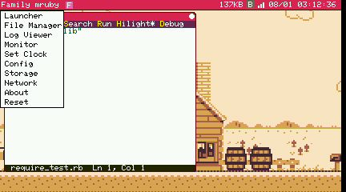
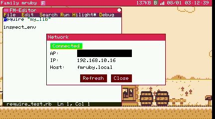

# Modern (M5Stack Tab5)

From an unmodified M5Stack Tab5 to the Family mruby desktop. Nothing to solder, nothing to
build — flashing happens from your browser and takes a couple of minutes.

<div align="center">
  
</div>

## What you need

### Required

- An [M5Stack Tab5](https://docs.m5stack.com/en/core/Tab5)
- A USB Type-C cable that carries data (a charge-only cable will not be seen by the browser)
- A PC with Chrome, Edge or Opera — flashing uses Web Serial, which Firefox and Safari do
  not implement

That is the whole list. The Tab5 has the screen, the speaker and the battery built in.

### To actually type

You need a keyboard, and there are two ways to get one:

- **A USB keyboard** in the Tab5's USB-A port. Add a USB hub if you want a mouse as well.
  See [Verified Devices](../compatibility.md) for what is known to work.
- **The M5Stack Tab5 Keyboard** accessory, which clips onto the body and needs no USB port.

You do not need a mouse: the touch screen works as a trackpad (see [Using
touch](#using-touch) below). A real mouse is still more comfortable for dragging windows.

### Nice to have

- **A Wi-Fi network.** With Wi-Fi configured you get the [remote desktop](../remote_desktop.md)
  — your PC's browser shows the Tab5's screen and drives it with your PC's keyboard and
  mouse — and apps can reach the internet.
- **A GROVE cable** if you want to talk to sensors, or send [MIDI](../api/midi.md) to an
  external sound module.

## Flashing the firmware

Modern is a single chip, so there is a single firmware to write.

1. Open the [Family mruby Web Installer](https://family-mruby.github.io/family-mruby-installer/)
   in Chrome, Edge or Opera
2. Connect the Tab5 to your PC with a USB-C cable
3. Scroll to the **Family mruby Modern (Tab5)** section
4. Pick the version you want (the newest is selected by default)
5. Press **Connect & Flash Tab5 firmware**
6. Choose the Tab5's serial port in the dialog the browser opens
7. Wait. The installer checks the chip is an ESP32-P4 and refuses if it is not, so you
   cannot flash the wrong image by mistake

The Tab5 talks to your PC over USB-Serial-JTAG, which means **you do not have to hold any
button** to put it into download mode — unlike many ESP32 boards. If flashing ever leaves
it stuck, press the reset button once and try again.

!!! note "This erases the flash filesystem"
    Flashing writes the whole image, including the file area. Anything you wrote on the
    device — your own apps, edited config files — is replaced by the shipped contents. Copy
    anything you care about off the device first (see [Console](console.md)).

More detail, including the Retro procedure and troubleshooting, is in
[Firmware Update](firmware_update.md).

## First boot

Press the power button. You will see, in order:

1. **A text boot screen** listing what the system is bringing up — memory, filesystem,
   drivers. It is there so a failed boot tells you where it stopped
2. **The logo**, opening from the centre, with the startup sound
3. **The desktop**: a menu bar along the top, the wallpaper below it, and a mouse cursor

If you reach the desktop and the cursor follows your finger, everything works.

## Finding your way around

<div align="center">
  
</div>

Click **Family mruby** at the top left for the system menu — Launcher, File Manager, Log
Viewer, Monitor, Set Clock, Config, Storage, Network, About and Reset. The right end of the
bar carries free internal memory, the BLE and Wi-Fi indicators, and the clock, and the
squares next to the title are the apps you have running.

`Ctrl` + `Q` closes the app in front, `Ctrl` + `Tab` switches between them, and on the
desktop a single letter starts one (`L` launcher, `S` shell, `E` editor).

The desktop is identical on both machines and is described in full in
[The Desktop](desktop.md) — what every element of the menu bar means, how the launcher
behaves, and what `Ctrl` + `Tab` does to a fullscreen app.

## Using touch

The touch panel behaves like a laptop trackpad, not like a phone. Your finger moves the
cursor; it does not teleport the cursor to where you touched. This keeps dragging window
title bars and scrollbars predictable.

| Gesture | Result |
|---|---|
| Slide a finger | Move the cursor. No click, so nothing under the cursor gets grabbed |
| Quick tap | Left click at the cursor position |
| Hold still, then move | Press and hold the left button, then drag. Lift to release |
| Two-finger tap | Right click at the cursor position |

The hold that starts a drag is 150 ms, so an ordinary tap (about 100 ms) still reads as a
click.

Pointer speed is adjustable: **Config** → `mouse_scale_x` / `mouse_scale_y`.

## Connecting to Wi-Fi

Wi-Fi gets you the [remote desktop](../remote_desktop.md) and the
[networking API](../api/network.md). Credentials go in `/etc/wifi.toml`, which you create
once on the device with the editor:

```toml
[wifi]
enable = true
ssid = "your-ssid"
password = "your-password"
hostname = "fmruby"
```

Save it, reboot from **Reset**, then check the system menu → **Network**.

<div align="center">
  
</div>

Full instructions, and what to do when it will not connect, are in
[Connecting to Wi-Fi](wifi.md).

!!! tip "Both radios at once"
    On Modern the ESP32-C6 handles Wi-Fi and BLE together, so the [web console](console.md)
    over BLE keeps working while Wi-Fi is up. (On Retro the ESP32-S3 has one radio and runs
    one or the other.)

## Seeing the screen on your PC

With Wi-Fi up, the Tab5 serves its own desktop. Open

```
http://fmruby.local/
```

in a browser on the same network — or the address shown in the **Network** dialog, if mDNS
does not resolve on your machine. You get the live screen, and your PC's keyboard and mouse
drive the device, global shortcuts included.

This is the fastest way to work: type on your PC's keyboard, watch the real hardware run.
See [Remote Desktop](../remote_desktop.md) for the details and the settings.

## Where your files go

The flash filesystem follows the usual Unix shape:

| Path | Contents |
|---|---|
| `/home` | Your files. Put your own `.rb` scripts here |
| `/app` | Installed apps, grouped into `demo`, `game`, `tool`, `basic` and so on |
| `/etc` | Configuration: `system_conf.toml`, `wifi.toml` |
| `/usr/share` | Bundled assets: fonts, wallpapers, sounds, MIDI and NSF songs |
| `/lib` | Ruby libraries reachable with `require` |
| `/var/cache` | Caches the system rebuilds on its own |

## Troubleshooting

### The browser does not offer a serial port

- Use a data-capable USB-C cable. Charge-only cables never appear
- Connect straight to the PC, not through a hub
- Chrome, Edge or Opera on the desktop. Firefox and Safari have no Web Serial

### Flashing finished but the screen stays dark

- Press the reset button once
- If the serial log shows `boot:0x204 (DOWNLOAD)` and `waiting for download`, the board
  stayed in download mode. Press reset and it will boot normally

### The keyboard does nothing

- Check the keyboard is in the USB-A port, not the USB-C one
- Some keyboards and hubs are not recognised; see [Verified Devices](../compatibility.md)
- If the layout is wrong (symbols land in the wrong places), set **Config** →
  `keyboard_layout` to `jp` or `us`

### The clock is wrong

Set the date and time from **Set Clock** in the system menu. The timezone is a separate
setting, under **Config**.

## Next steps

- [Hello World](hello_world.md) — write and run your first app
- [Default Apps](default_apps.md) — what is already installed
- [Remote Desktop](../remote_desktop.md) — work from your PC's browser
- [API Reference](../api/index.md) — what your app can call
- [Hardware](../hardware.md) — pin assignments and the GROVE port
