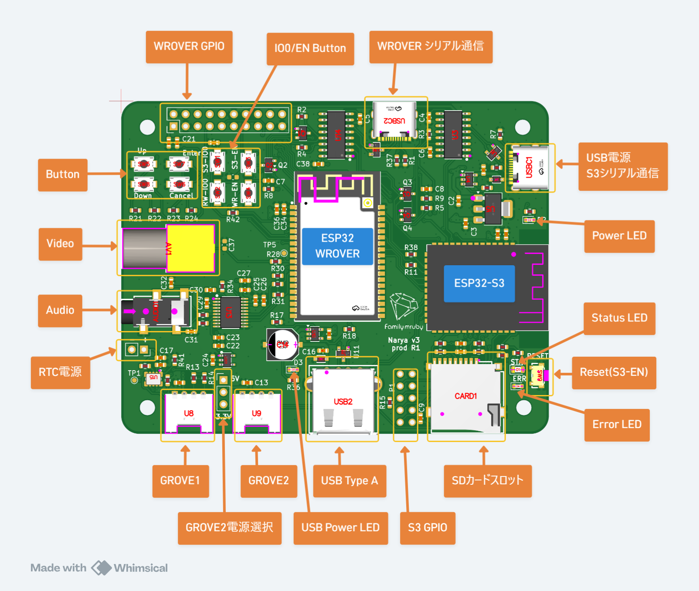
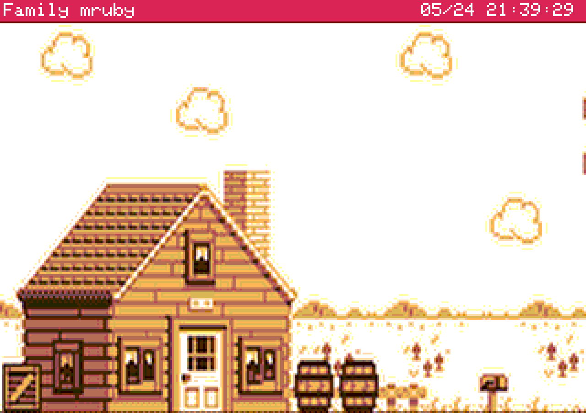

# Setup

This section describes the steps to get the first screen displayed.

## Items to Prepare Separately

### Required

- USB Type-C cable (for power supply)
    - A standard cable used for smartphones, etc. will work fine
- 5V USB power source
    - A PC USB port or a USB-AC adapter (5V 1A or higher)
- NTSC-compatible display device
    - CRT monitor, video capture device, LCD with composite input, etc.
    - If you want to display on an HDMI-compatible monitor, you can use a converter device such as the following:
    - [Amazon](https://www.amazon.co.jp/dp/B0DCJ84SVN)
- RCA composite cable (cable with yellow connector)
    - Shorter cables tend to produce more stable video
- 3.5mm stereo mini-jack cable (for audio output)
    - For connecting to earphones or speakers
- USB keyboard
    - For confirmed working devices, see [Verified Devices](../../compatibility). Some keyboards may not be recognized due to compatibility issues.
- USB mouse
    - For confirmed working devices, see [Verified Devices](../../compatibility). Some mice may not be recognized due to compatibility issues.

### Nice to Have

- USB Hub
    - Required if the keyboard and mouse are not an integrated unit.
    - For confirmed working devices, see [Verified Devices](../../compatibility). Some hubs may not be recognized due to compatibility issues.
- USB gamepad
    - Details to be added later
- SD card
    - For when you need to handle large data

### If You Want to Retain the Clock

 - CR2032 button cell battery case & CR2032 button cell battery
    - By soldering a battery case and supplying power to the RTC, the device can retain the time even when the main power is turned off.

## Connecting the Ports

Referring to the diagram, connect cables to the Video and Audio ports, then connect the USB cable to the USB power source.

## Powering On

The device starts automatically when the USB Type-C cable is connected. There is no power switch.

To turn off the power, unplug the USB Type-C cable.

## Screen Displayed After Startup

After the logo is displayed, the following desktop screen will appear. If you can operate the mouse cursor, everything is working correctly.

A startup sound also plays while the logo is being displayed.

## Troubleshooting Checklist

### Check the LED Status

| LED | State | Meaning |
|---|---|---|
| STATUS (green) | Fast blinking | Booting |
| STATUS (green) | Slow blinking every few seconds | Running normally |
| STATUS (green) | Off or stays lit | Possible hang-up |
| ERROR (red) | Lit | System state error |
| POWER | Lit | Power is connected |
| USB-POWER | Lit | USB host power is supplied |

If the POWER LED does not light up, the power supply is not connected. Please check the power source.

### Keyboard or Mouse Not Responding

- If possible, try a different keyboard, try connecting without going through a USB hub, etc. Please restart the device after swapping peripherals.

## Next Steps

- Try out the pre-installed apps
- Write your own app → [Hello World](hello_world.md)
- Transfer apps and files from a PC → [Console](console.md)
- Hardware specifications → [Hardware](../hardware.md)
