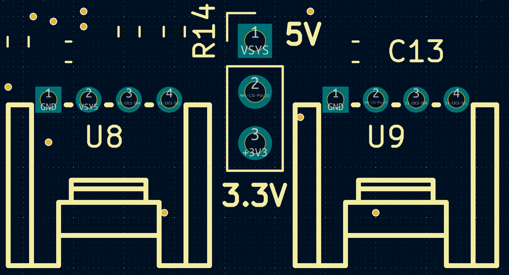
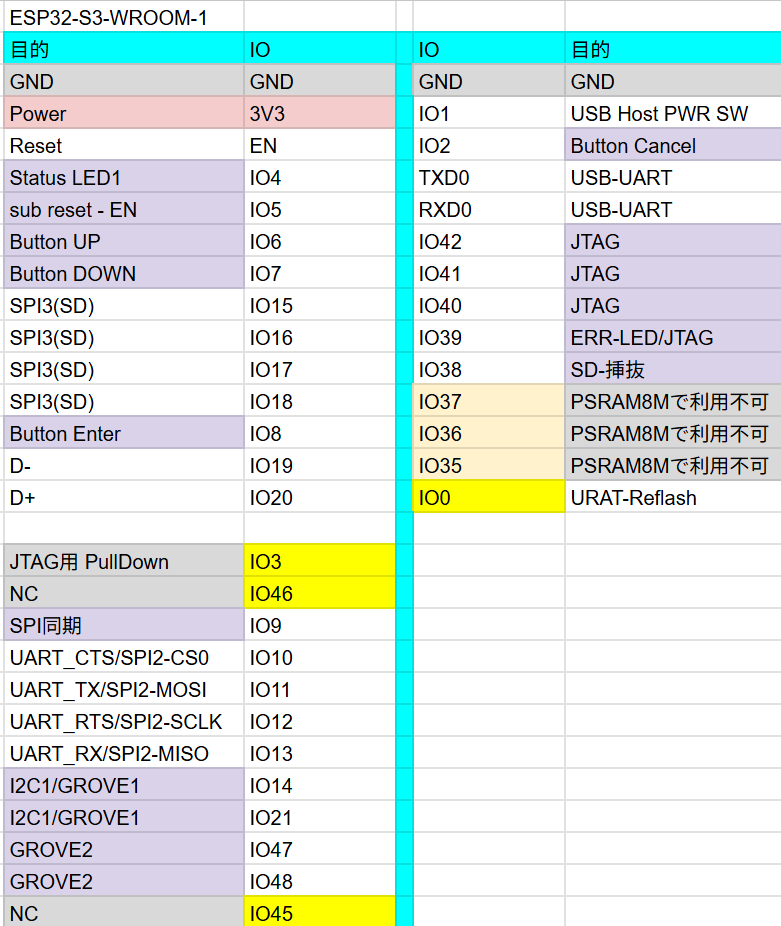
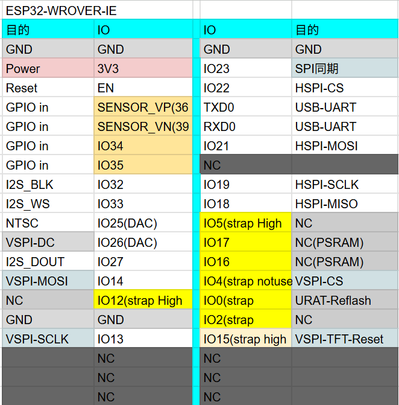
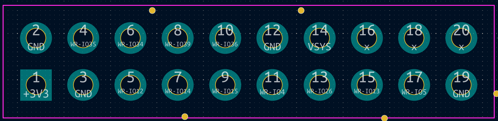

# Hardware

Specifications for the connectors and pin assignments of the narya-board.


!!! note
    For schematics, KiCAD design files, and board photos, see the [narya-board repository](https://github.com/family-mruby/narya-board).

## Overview

| Item | Details |
|---|---|
| Main MCU (fmrb-core) | ESP32-S3-WROOM-1-N16R8 (16MB Flash + 8MB PSRAM) |
| Sub MCU (fmrb-graphics-audio) | ESP32-WROVER-E/IE (with PSRAM) |
| Inter-MCU Communication | UART1 (921600 bps, CTS/RTS flow control) |
| Video Output | NTSC composite (using LovyanGFX CVBS) |
| Audio Output | I2S DAC (NES APU emulator) |
| Storage | Internal LittleFS (16MB) + SD card (FAT32, SPI connection) |

## Power Supply

| Item | Value |
|---|---|
| Input | USB Type-C (5V) |
| Internal Regulator | 3.3V |
| Recommended Power | Stable USB supply of 1A or more |

## Video Output

| Item | Value |
|---|---|
| Connector | RCA (pin jack, yellow) |
| Signal Format | NTSC composite |
| Standard Resolution | 320 x 240 |
| Color | RGB332 (256 colors) |

If colors appear different due to variations in CRT monitors or capture devices, you can adjust them using `FmrbGfx#set_output_level` / `set_chroma_level`.

## Audio Output

| Item | Value |
|---|---|
| Connector | 3.5mm stereo mini jack |
| Signal | I2S to DAC analog output |
| Output Level | Line-level equivalent |

The NES APU emulator runs with 4 channels: 2 square waves + 1 triangle wave + 1 noise channel. See [FmrbAudio](api/audio.md) and [Audio File Formats](file_formats/audio_formats.md) for details.

## GROVE

The board has 2 GROVE connectors. Listed from left: GND, Power, Sig1, Sig2. The connections are as follows:

| Connector | Sig1 | Sig2 | Notes |
|---|---|---|---|
| GROVE 1 | GPIO 14/I2C1-SDA | GPIO 21/I2C1-SCL | For I2C / shared with RTC (RX8900, address: 0x32). 10K pull-up resistors present |
| GROVE 2 | GPIO 47 | GPIO 48 | General purpose. No pull-up resistors. Power source selectable |

GROVE 1 shares the I2C bus with the RTC, so be careful about address conflicts.

GROVE 2 has no pull-up resistors on the signal lines, and the power supply method can be changed via pin headers, so it can be used freely for UART, [RMT](api/peripherals.md#rmt), and other purposes.



## Pin Assignments

ESP32-S3 Pin Assignment



ESP32-WROVER Pin Assignment



### I2C

| Bus | SDA | SCL | Notes |
|---|---|---|---|
| I2C1 | GPIO 14 | GPIO 21 | Shared with RTC (RX8900) |
| I2C2 | GPIO 47 | GPIO 48 | General purpose |

Use with `I2C.new(unit: "ESP32_I2C0", ...)` etc. (see [Peripherals > I2C](api/peripherals.md#i2c)).

### External GPIO

Pin Locations (S3)


Pin Locations (WROVER)



## RTC (Real-Time Clock)

The board includes an RX8900 RTC IC (I2C address 0x32, via I2C1). Time is maintained by a battery.

```ruby
i2c = I2C.new(unit: "ESP32_I2C0")
rtc = RX8900.new(i2c)
rtc.sync_system_clock
```

See [RX8900 API](api/utilities.md#rx8900) for details.

## Related

- Check before using pins: [FmrbHw](api/const.md#fmrbhw)
- Peripheral API: [Peripherals](api/peripherals.md)
- From boot to your first app: [Setup and Connection](getting_started/setup.md)
