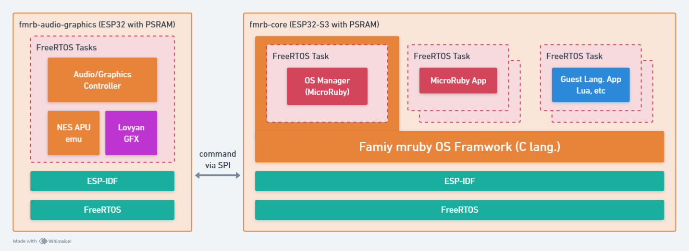

# Family mruby ドキュメント

  

## Family mruby について

[解説記事](https://blog.silentworlds.info/family-mruby-os-freertosbesunomicrorubymarutivmgou-xiang/)

ドキュメント整備中

## リポジトリ

https://github.com/family-mruby

## デモ動画

  <iframe width="560" height="315" src="https://www.youtube.com/embed/Wa_3XtLF-6U" title="YouTube video player" frameborder="0" allow="accelerometer; autoplay; clipboard-write; encrypted-media; gyroscope; picture-in-picture" allowfullscreen></iframe>

## Family mruby とは？

昔、子供が最初に触れるプログラミング言語といえば、BASICという時代がありました。 制約は多いですが、パソコン以外にも、MSXやファミコンでBASICができるFamily BASICという製品もあり、そこからプログラミングの面白さを知り、プログラマーになった方もたくさん居られると思います。
そして現在は無料で大抵のプログラミング言語の開発環境はパソコンにインストールすることができる時代になりましたが、できることが多すぎて何をしたらよいのかわからなかったり、Hello Worldの先のゲームを作ったりするまでの環境構築ハードルが高かったり、するような気がしています。
そこで、マイコン一つでちょっとしたゲームなどをスクリプト言語で作れる環境を作ってみたい、と思って開発したのが、**Family mruby** です。

## アーキテクチャ

  

Family mruby は、FreeRTOS上に構築された「MicroRubyベースのマルチVM」を実装する個人プロジェクトです。このシステムは複数のMicroRuby仮想マシンを同時実行できます。

アーキテクチャは2つの主要コンポーネントで構成されています：

- **fmrb-core (ESP32-S3 with PSRAM)**: Family mruby OSフレームワークを実行するメイン処理ボード。複数のFreeRTOSタスクをホストし、それぞれが独立したVMを実行します：
  - OS Manager (MicroRuby): システム管理と調整
  - MicroRuby App: Rubyで書かれたユーザーアプリケーション
  - Guest Language Apps: Luaなどの他のスクリプト言語のサポート

- **fmrb-audio-graphics (ESP32 with PSRAM)**: オーディオ/グラフィックス処理を担当する専用ボード。Audio/Graphics Controller、NES APUエミュレータ、LovyanGFXライブラリを含みます。コアボードとはSPI経由で通信します。

### マルチVM

このシステムは「一つのタスク = 一つのVM」という設計思想に従い、FreeRTOSのタスク機能を活用して複数のVMを並列実行します。各VMは独自のスタックとメモリ空間を持ち、独立して動作することで隔離性と安定性を確保しています。

### 主な特徴

- **OSの基盤**: ESP-IDF上で動作するFreeRTOS
- **VM実装**: mrubyベースのMicroRuby VMを使用
- **独立したメモリプール**: 各VMは独自のメモリアロケータハンドルを持ち、システム全体のメモリ断片化を防止し、個々のVMの障害を隔離します
- **多言語サポート**: MicroRubyを主要サポート、Luaの実験的サポート、MicroPythonの統合も計画中

### ターゲットハードウェア

PSRAMを搭載したESP32デバイス（例：ESP32-S3-WROOM-1-N16R8）向けに設計されています。カスタム開発ボードも開発中です。

