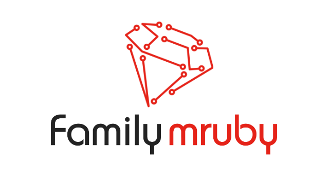

# Family mruby ドキュメント

<div align="center">
  
</div>

## Family mruby について

[解説記事](https://blog.silentworlds.info/family-mruby-os-freertosbesunomicrorubymarutivmgou-xiang/)

## リポジトリ

[https://github.com/family-mruby](https://github.com/family-mruby)

## ファームウェア更新

ブラウザだけでファームウェアを書き込める Web インストーラがあります（Chrome / Edge / Opera 対応）。

[https://family-mruby.github.io/family-mruby-installer/](https://family-mruby.github.io/family-mruby-installer/)

詳細は [はじめに ▸ ファームウェア更新](getting_started/firmware_update.md) を参照。

## 実機なしで試す

Docker と Web ブラウザだけで Family mruby OS を体験できます。

```bash
docker run --rm -p 6080:6080 ghcr.io/family-mruby/fmruby-desktop:latest
```

→ ブラウザで [http://localhost:6080/vnc.html](http://localhost:6080/vnc.html)

詳細は [はじめに ▸ シミュレータ](getting_started/simulator.md) を参照。

## デモ動画

<div align="center">
  <iframe width="560" height="315" src="https://www.youtube.com/embed/Wa_3XtLF-6U" title="YouTube video player" frameborder="0" allow="accelerometer; autoplay; clipboard-write; encrypted-media; gyroscope; picture-in-picture" allowfullscreen></iframe>
</div>

## Family mruby とは？

昔、子供が最初に触れるプログラミング言語といえば、BASICという時代がありました。 制約は多いですが、パソコン以外にも、MSXやファミコンでBASICができるFamily BASICという製品もあり、そこからプログラミングの面白さを知り、プログラマーになった方もたくさん居られると思います。
そして現在は無料で大抵のプログラミング言語の開発環境はパソコンにインストールすることができる時代になりましたが、できることが多すぎて何をしたらよいのかわからなかったり、Hello Worldの先のゲームを作ったりするまでの環境構築ハードルが高かったり、するような気がしています。
そこで、マイコン一つでちょっとしたゲームなどをスクリプト言語で作れる環境を作ってみたい、と思って開発したのが、**Family mruby** です。

システムのアーキテクチャについては [アーキテクチャ](architecture.md) ページを参照してください。
