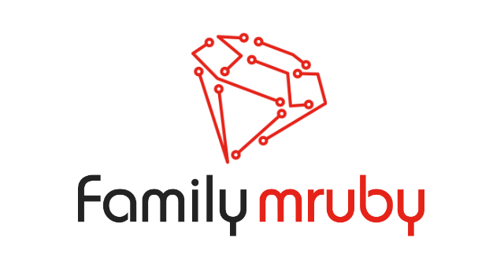

# Family mruby Documentation

  

## What is Family mruby?

Family mruby is an environment where you can enjoy developing Ruby applications by connecting a keyboard, mouse, and monitor to an ESP32 microcontroller board.

It is built on PicoRuby and features a built-in OS.

You can easily create graphical applications with PicoRuby, control externally connected electronic devices, build standalone games, and explore many other possibilities.

### Connected Devices

Here is an example of various devices connected to the board. (These are not included with the product.)

## Demo Video

<iframe width="560" height="315" src="https://www.youtube.com/embed/9vkRaOoxJJI?si=3cVBhbfFsFDwEQny" title="YouTube video player" frameborder="0" allow="accelerometer; autoplay; clipboard-write; encrypted-media; gyroscope; picture-in-picture; web-share" referrerpolicy="strict-origin-when-cross-origin" allowfullscreen></iframe>

## Hardware

A dedicated board is available for purchase on [BOOTH](https://booth.pm/ja/items/8128031).

The schematics, Gerber data, and BOM are all publicly available, so you can also build a compatible board yourself.

## Usage

See [Getting Started](getting_started/booth) for details.

## Repositories

- [Firmware](https://github.com/family-mruby/family-mruby)
- [Board Data](https://github.com/family-mruby/narya-board)

## Development Background

Long ago, BASIC was often the first programming language that children encountered. Despite its limitations, there were products like Family BASIC, which allowed BASIC programming not only on PCs but also on platforms such as the MSX or the Famicom (NES). Many programmers discovered the joy of programming through these environments.

Today, development environments for most programming languages are freely available and easily installable on PCs. However, because so much is possible, beginners often don't know where to start. Even reaching the point where you can make something slightly beyond "Hello World," such as a simple game, can require a surprisingly high setup cost.

Family mruby was born from the desire to create an environment where you can build small games and other applications using a scripting language on a single microcontroller -- bringing back the joy of simple, immediate programming.
